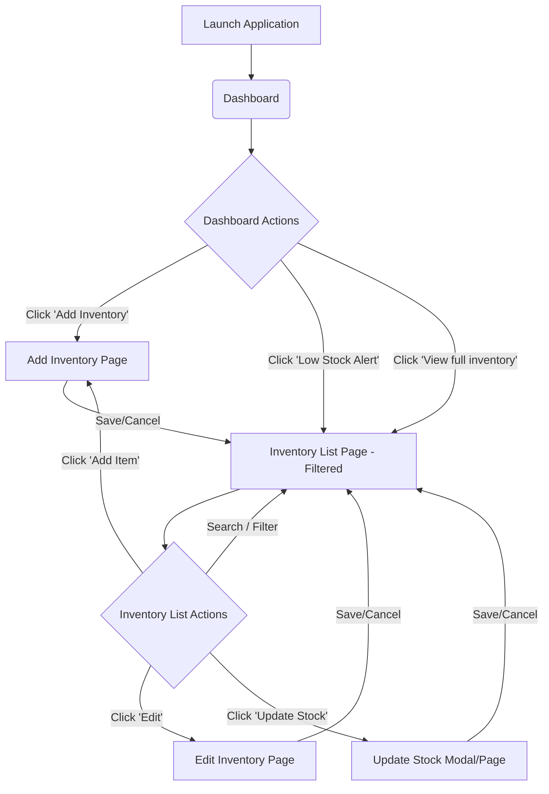
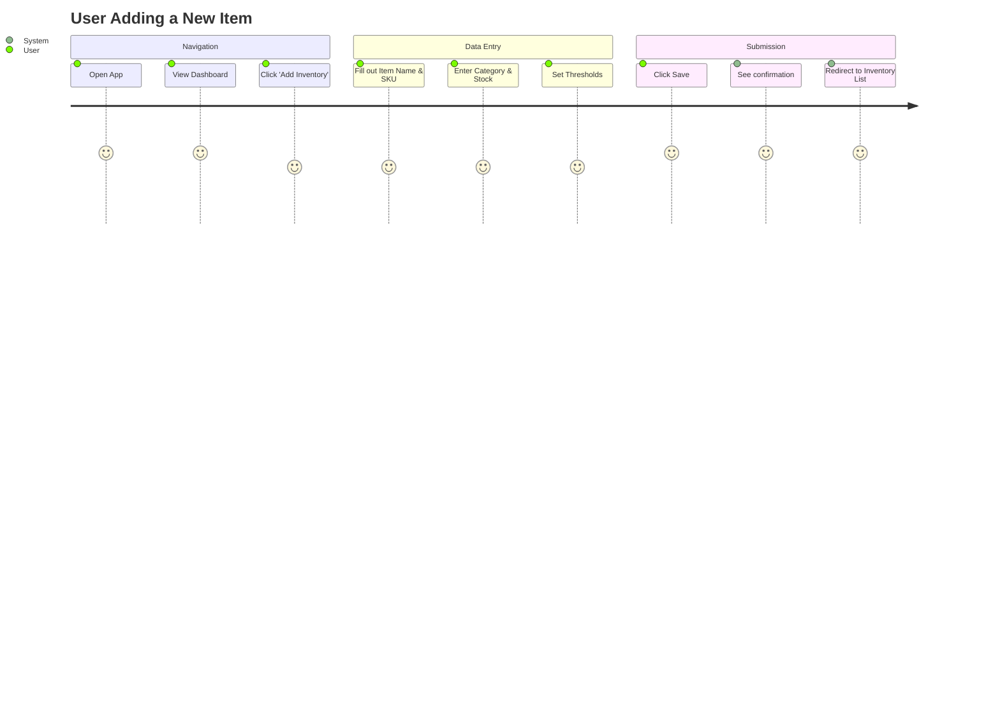
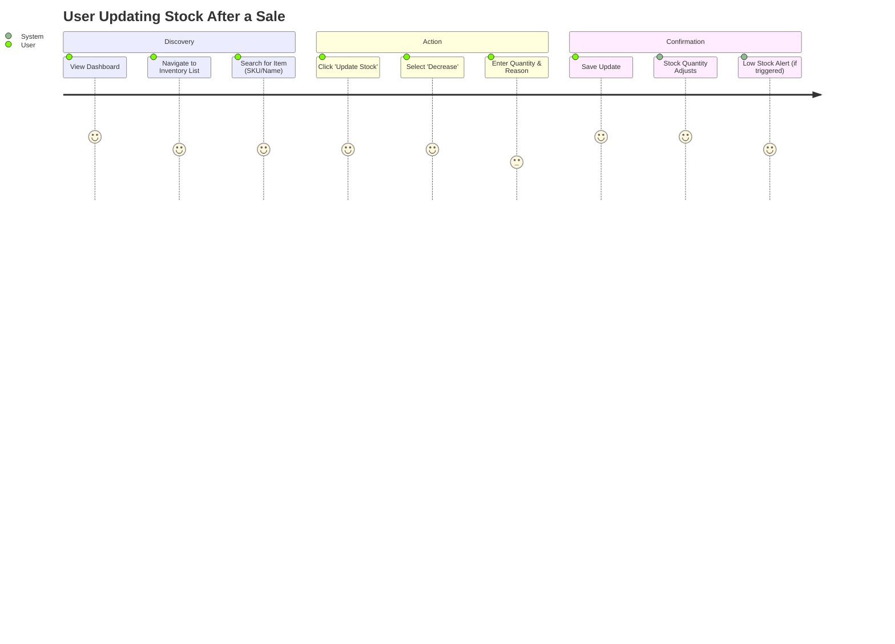
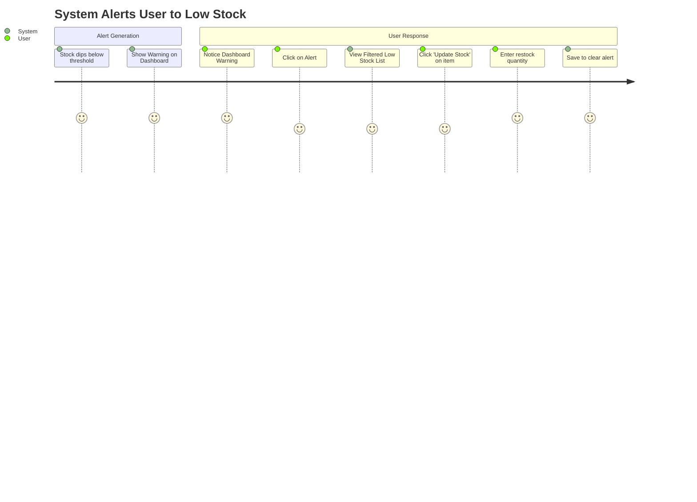

# UX Design - Smart Inventory Tracker

## 1. Navigation Structure

The navigation is designed to be flat and accessible, prioritized for a clean, lightweight web application.

- **Primary Navigation (Sidebar or Top Nav)**
  - **Dashboard**: The central hub for overview metrics and alerts.
  - **Inventory**: The complete list of items with search, filter, and management actions.
  - **Add Item**: Quick access to introduce a new item to the system.
  - **Settings (Optional)**: For profile or application-level settings.

## 2. Application Flow Map

## 3. User Journey Diagrams

### Journey 1: Adding a New Inventory Item

### Journey 2: Processing a Stock Update

### Journey 3: Handling Low Stock Alerts

## 4. Wireframe Descriptions

### 4.1. Dashboard Page
* **Layout**: Two-column or responsive modular grid.
* **Header**: App Title, Date/Time, User Profile icon.
* **Top Row (Cards)**:
  - Total Items in Inventory (Big Number)
  - Items Low in Stock (Warning Color - Yellow/Red)
  - Recently Updated Counter
* **Main Content Area**:
  - **Quick Actions Section**: Prominent "Add New Item" button.
  - **Low Stock Alerts List**: A mini-table showing the top 5 urgent restock needed items (Item Name, Current Stock, Threshold). Clickable rows taking the user to the Update Stock flow.
  - **Recent Activity Feed**: A list showing the last a few stock updates (e.g., "Updated +15 Stock for 'Coffee Beans' - 2 mins ago").

### 4.2. Inventory List Page
* **Layout**: Full-width table layout.
* **Header**: "Inventory Management", "Add Item" CTA (Call to Action).
* **Search & Filters (Above Table)**:
  - Search UI (by Name/SKU).
  - Filter dropdown by Category.
  - Filter dropdown by Stock Status (All, Low Stock, Out of Stock, Healthy).
* **Table**:
  - Columns: Item Name, SKU, Category, Current Stock, Min Threshold, Status (Pill - Green/Yellow/Red), Actions.
  - **Status Pill**: Visual indicators for instant recognition.
  - **Actions Column**: Ghost buttons or icons for [Edit] (Pencil icon) and [Update Stock] (Plus/Minus or Refresh icon).
* **Pagination**: Bottom area with page controls.

### 4.3. Add Inventory Page
* **Layout**: Focused centered form or a slide-out side panel (to retain context of the list underneath if possible, but centered form page is also acceptable).
* **Header**: "Add New Inventory Item".
* **Form Sections**:
  - **Basic Info**: 
    - Item Name (Required)
    - SKU/Product ID
    - **Category**: Dropdown selecting from existing database categories + "Add New..." option. Selecting "Add New..." reveals a text input for manual entry.
  - **Stock Details**: Current Stock Quantity (Required, Default 0), Minimum Stock Threshold (Required, Default 0).
  - **Financial Info (Optional)**: Unit Price, Supplier.
* **Footer Actions**: "Cancel" (Ghost button), "Save Item" (Primary solid color button).
* **State**: Real-time inline field validation (e.g., green checkmarks or red helper text).

### 4.4. Edit Inventory Page
* **Layout**: Identical to Add Inventory page.
* **Header**: "Edit [Item Name]".
* **Form Area**: Pre-filled with the item's existing data.
* **Additional Elements**: A clear "Delete Item" button (stylized in red to prevent accidental clicks) placed far from the primary Save action.

### 4.5. Update Stock Modal (or Page)
* **Layout**: Modal overlay (retaining the context of the Inventory list for speed) or dedicated focused page.
* **Header**: "Update Stock: [Item Name] (SKU: 12345)"
* **Body Elements**:
  - **Current Stock Display**: Boldly showing current stock quantity.
  - **Action Type**: Segmented control or radio buttons (Increase, Decrease, Manual Set).
  - **Quantity Input**: Number field with prominent + / - stepper arrows.
  - **Text Area**: "Reason for update (Optional)".
* **Footer Actions**: Cancel, "Confirm Update".
