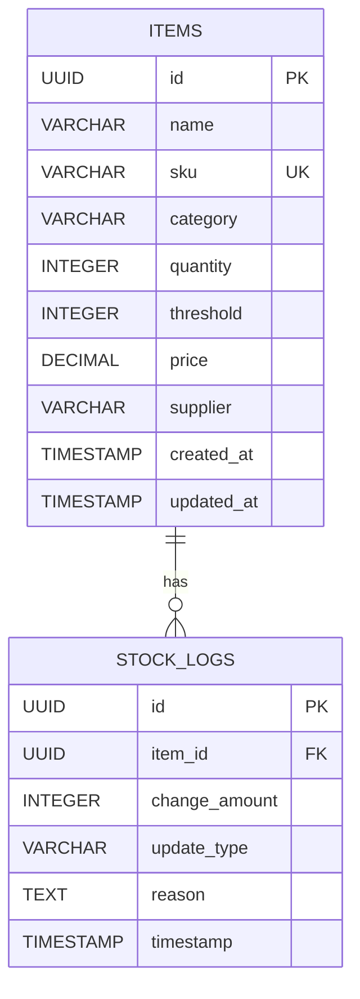

# Database Architecture: Smart Inventory Tracker

## 1. Database Schema

### Table: `items`
Stores the core inventory items.
- `id` (UUID, Primary Key): Unique identifier for the item.
- `name` (VARCHAR): Name of the inventory item.
- `sku` (VARCHAR, Unique): Stock Keeping Unit, used for identification.
- `category` (VARCHAR): Classification of the item.
- `quantity` (INTEGER): Current stock level.
- `threshold` (INTEGER): Minimum stock level before an alert is triggered.
- `price` (DECIMAL): Unit price of the item.
- `supplier` (VARCHAR): Name of the supplier.
- `created_at` (TIMESTAMP): Record creation timestamp.
- `updated_at` (TIMESTAMP): Record last update timestamp.

### Table: `stock_logs`
Tracks all changes to inventory stock levels.
- `id` (UUID, Primary Key): Unique identifier for the log entry.
- `item_id` (UUID, Foreign Key): Reference to `items.id`.
- `change_amount` (INTEGER): Positive (stock added) or negative (stock removed).
- `update_type` (VARCHAR): E.g., 'purchase', 'sale', 'adjustment'.
- `reason` (TEXT): Optional explanation for the change.
- `timestamp` (TIMESTAMP): When the change occurred.

## 2. Entity Relationship Diagram (ERD)



## 3. Data Integrity Rules

- **Foreign Keys**: `stock_logs.item_id` references `items.id` with `ON DELETE RESTRICT` (to ensure history is not lost if an item is accidentally deleted) or `ON DELETE CASCADE` if hard deletion is required. We'll use `CASCADE` for simplicity in the initial state, but typically soft deletes (`is_active` boolean on `items`) are preferred in production.
- **Unique Constraints**: `items.sku` must be unique across the table to ensure accurate tracking.
- **Check Constraints**: 
  - `items.quantity >= 0` (Cannot have negative stock)
  - `items.threshold >= 0` (Threshold must be a valid non-negative number)

## 4. Indexing Strategy

To support fast queries described in the PRD, the following indexes are recommended:

1. **`idx_items_sku` (items)**: For fast, unique lookups by SKU.
2. **`idx_items_category` (items)**: Helpful for reporting or filtering inventory lists by category.
3. **`idx_stock_logs_item_id` (stock_logs)**: Crucial for retrieving the history of a specific item without scanning the full logs table.
4. **`idx_stock_logs_timestamp` (stock_logs)**: Accelerates time-based queries (e.g., retrieving recent activity on the dashboard).

## 5. Query Optimization Strategy

### 1. Dashboard Metrics
- **Low Stock Detection**: Instead of pulling all items into memory, use a query directly comparing quantity and threshold:
  ```sql
  SELECT count(*) FROM items WHERE quantity <= threshold;
  ```
  *Optimization*: Provide a partial index on `(quantity, threshold)` or a calculated column if this query becomes a bottleneck.

### 2. Inventory List (Pagination)
- Use `LIMIT` and `OFFSET` for simple pagination on the inventory list.
- Use keyset pagination (`WHERE id > :last_id`) if the inventory grows extremely large to prevent slow offsets.

### 3. Calculating Current Stock Reliability
- The `items.quantity` acts as a cached value. In highly concurrent systems, ensure row-level locking (`SELECT ... FOR UPDATE`) is used when updating `quantity` and inserting into `stock_logs` within a single transaction to prevent race conditions.
